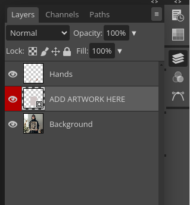

# Photopea Smart Object Integration

This project integrates Photopea's functionality into a browser-based tool for processing images with smart object templates. It allows users to select multiple input images, automate the processing, and save the results to an output folder.

# Technologies Used
* JavaScript (Frontend scripting for interaction with Photopea)
* HTML & CSS (Interface layout and styling)
* Photopea API (To send commands to Photopea via postMessage)

# Installation

    git clone https://github.com/KeenSightAutomations/Photopea-Integration.git

# How To Run

* **Method 1**
    ```
    cd photopea-integration

    Start a local web server (e.g., using Python):
    python -m http.server 8000

    // Open your browser Chrome Or Edge
    http://localhost:8000
    ```

* **Method 2**
    ```
    cd photopea-integration

    press right click on index.html and choose open with google chrome
    ```


# Usage
## Step 1: Load a Smart Object Template
* start using Photopea editor.
* Use the "Open from Computer" option to load a PSD mockup with a smart object layer.

* make sure the smart object layer( have a little sign in the bottom-right corner of the thumbnail.) is the active layer like this image after open psd file you can find layers on right place if not found it press on this icon to find it 

  

    

* This example to show which layer is smart object
    


## Step 2: Select Folders
* Click "Select Input Folder" to choose the folder containing the images you want to process.
* Click "Select Output Folder" to choose the folder where the processed images will be saved.

## Step 3: Process Images
* Click "Process All Images" to automatically process all images in the input folder using the loaded template.
* Monitor progress through notifications.

## Step 4: Save and Export
* Processed images are saved automatically in the selected output folder.


# Permissions
## Granting Permissions
The app requires browser permission to access local folders:
* When prompted, select the input/output folders.
* Ensure read-write access is granted.
## Troubleshooting Permission Issues
* If permission is denied, you can clear permissions in your browser settings and re-select the folders.


# Scripts Overview
* script.js: Main functionality, including folder selection, smart object checking, and batch processing.
* styles.css: Styling for the user interface.
* index.html: HTML structure for the interface.

# Troubleshooting
* Issue: Can't Select Folder(Input or Output)
    * Solution: Ensure that you are use google chrome or edge browser

* Issue: No smart object layer detected.

    * Solution: Ensure the smart object layer is active in the PSD file before running the script.
